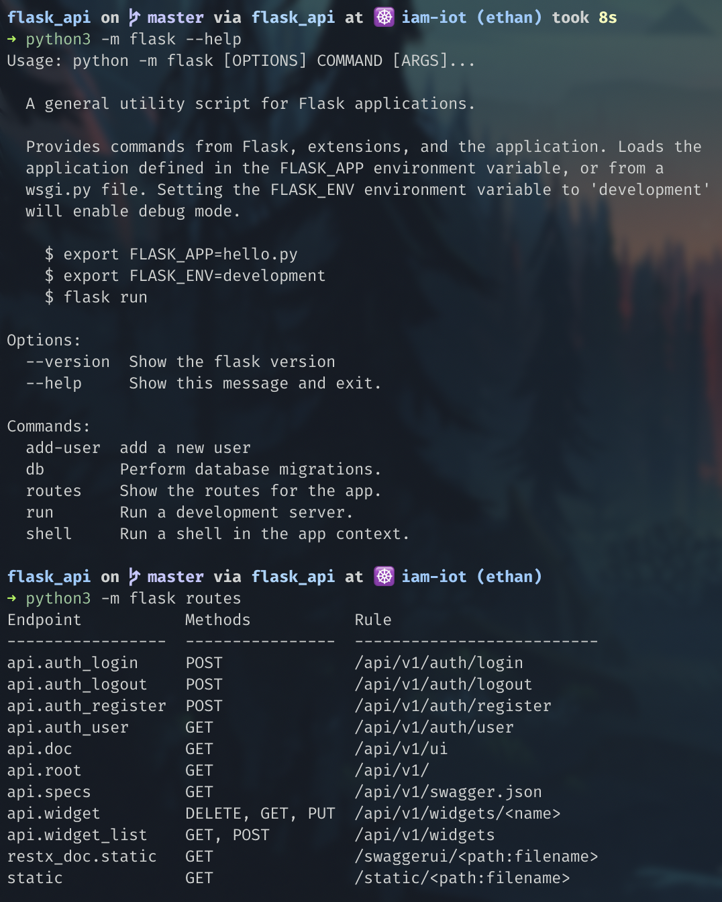
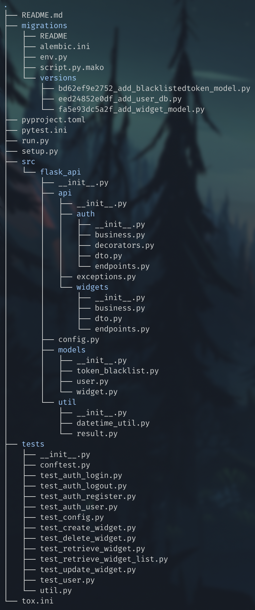

# Flask API

This repo is for personal learning purpose only.  
And [workshop](workshop.md).

From [Aaron Luna](https://github.com/a-luna) "How to":  
[Awesome source](https://aaronluna.dev/series/flask-api-tutorial/overview/)
(Tips: be ready !)  

## Installation:

Clone this repo, go in and:  

```bash
# Create a virtual env
virtualenv venv
# Activate the env
source venv/bin/activate
# Make install
pip install -e .
```

# Know bugs:

```bash
Traceback (most recent call last):
  File "./pip3.7", line 5, in <module>
    from pip._internal.cli.main import main
ModuleNotFoundError: No module named 'pip._internal.cli.main'
```

One found solution:
```bash
python3 -m pip install -e .
```

This pip cmd'll use `setup.py` to install all needed packages.  

Try those commands to validate installation:  
(Maybe it's not `python3` for you, just be sure to use python within the virtual env)  

 

---

## Tree:

  

### Folder: migrations  

This folder is created by [Alembic](https://alembic.sqlalchemy.org/en/latest/) (A lightweight database migration tool used by SQLAlchemy Database Toolkit for Python.)  
It contains scripts that is specific to a particular application. The migration environment is created just once,  
and is then maintained along with the application’s source code itself. The environment is created using the init command of Alembic,  
and is then customizable to suit the specific needs of the application.

[Tutorial](https://alembic.sqlalchemy.org/en/latest/tutorial.html)  
[Anchor](#db_ancre)  

### File: pyproject.toml  

[S&M](http://sametmax.com/vive-setup-cfg-et-mort-a-pyproject-toml/)  
This files contains config for [Black](https://github.com/psf/black).  
[More info about](https://bskinn.github.io/My-How-Why-Pyproject-Src/)  

### File: pytest.ini  

The pytest framework makes it easy to write small tests, yet scales to support complex functional testing for applications and libraries.  
This file contains config for [`Pytest`](https://docs.pytest.org/en/latest/) and [`Flake8`](https://flake8.pycqa.org/en/latest/)  
[More info about](https://docs.pytest.org/en/latest/customize.html)  

### File: `run.py`  

This is the application entry point.  

### File: `setup.py`  

[Python setup explaination](https://github.com/pypa/sampleproject/blob/master/setup.py)  

### Folder: src

This folder contains all the API sources.

#### Folder: api

This folder contain the main [API logic](https://aaronluna.dev/series/flask-api-tutorial/part-3/#api-configuration-with-flask-restx).

Files in auth|widgets|...:
- `business.py`: This file contains the business logic that executes when an API endpoint in this namespace receives a valid request.
- `decorator.py` This file contains all decorators ([S&M](http://sametmax.com/comprendre-les-decorateurs-python-pas-a-pas-partie-1/)) that'll be used in the app.
- `dto.py`: DTO stands for data transfer object. This file will contain custom objects that parse and validate request data, and API model classes that will serialize our database model classes to JSON objects before sending them in an HTTP response.
- `endpoints.py`: This file will contain Flask-RESTx Resource classes. Resources are the most important individual parts of a REST API. Each resource is an API endpoint, and the methods we add to each Resource class control the HTTP methods the endpoint responds. The following method names are automatically mapped to the corresponding HTTP methods: get, post, put, delete, patch, options and head.

#### Folder: models

This folder contain [DataBase models](https://aaronluna.dev/series/flask-api-tutorial/part-2/#user-db-model)

#### Folder: util

- The [datetime_util](https://aaronluna.dev/series/flask-api-tutorial/part-1/#datetime_util-module) module contains helper functions for converting datetime objects from naive to timezone-aware, formatting datetime and timedelta objects as strings and a namedtuple named timespan that represents the difference between two datetime values but provides more data than the set of attributes provided by the timedelta class.

- The [Result](https://aaronluna.dev/blog/error-handling-python-result-class/) class is intended to be used for error handling as an alternative to throwing and handling exceptions.  

### File: `config.py`

This file contains the config classes for our application. (env based)

### File: `tox.ini`

[Tox](https://tox.readthedocs.io/en/latest/) is a generic virtualenv management and test command line tool you can use for:

- Checking your package installs correctly with different Python versions and interpreters
- Running your tests in each of the environments, configuring your test tool of choice
- Acting as a frontend to Continuous Integration servers, greatly reducing boilerplate and merging CI and shell-based testing.

### Hidden File: `.env`

As long as [python-dotenv](https://github.com/theskumar/python-dotenv) is installed,  
when the flask command is run any environment variables defined in .env will be set.  
This allows the os.getenv method to retrieve the values defined in .env and use them in our Flask application.  

Path: Project root "/"  

Content:  
```python
FLASK_APP=run.py
FLASK_ENV=development
SECRET_KEY=""
```
[Secret key Anchor](#secret_ancre)

### Folder: tests  

`conftest.py`: contains every fixtures used by pytest (Reserved file name, auto-used/imported by pytest)  
`util.py`: contain fonction that make some requests on the api.

### File: `.pre-commit-config.yaml`

Use pre commit config, in order to run black on all files being committed:  

---

## Unitary tests:

### Tox:

[Tox doc](https://tox.readthedocs.io/en/latest/) Again.  

Run it from venv:  
`tox`  

It'll run every tests.  

### Pytest :

[Pytest for flask](https://pypi.org/project/pytest-flask/)  
[Pytest Tricks](https://flask.palletsprojects.com/en/1.1.x/testing/)  

`client` is a fixture provided by pytest-flask, it's an instance of `app.test_client`.  
`test_client` == `client`

---

## Run server localy:

[Gunicorn](https://gunicorn.org) 'Green Unicorn' is a Python WSGI HTTP Server for UNIX. It's a pre-fork worker model.  
The Gunicorn server is broadly compatible with various web frameworks, simply implemented, light on server resources, and fairly speedy.

[Gunicorn concurrency](https://medium.com/building-the-system/gunicorn-3-means-of-concurrency-efbb547674b7)

While in project / and venv activated:  
```bash
gunicorn -b 0.0.0.0:8000 \
        --workers=3 \
        --threads=2 \
        --log-level=debug \
        run:app
```  
Or  
```bash
gunicorn -b 0.0.0.0:8000 \
        --workers=3 \
        --worker-class=gevent \
        --worker-connections=1000 \
        --preload \
        --log-level=debug \
        run:app
```  

---

## Call with httpie (instead of curl):

[HTTPie](https://httpie.org) is a command line HTTP client with an intuitive UI, JSON support, syntax highlighting, wget-like downloads, plugins, and more.

Example: `http -f :5000/api/v1/auth/register email=ethan@test.fr password=23423`  

---

## Flask Behavior:

### Secret key<a id="secret_ancre"></a>:

The SECRET_KEY will be used to sign our JSON authorization tokens (and every thing that needs to be crypted).  
The value you choose for this key should be a long, random string of bytes.  
It is absolutely vital that this value remains secret since anyone who knows the value can generate authorization keys for your API.  

How to gen:  
```python
>>> import os
>>> os.urandom(24)
b'\x1ah\xe9\x00\x04\x1d>\x00\x14($\x17\x90\x1f?~?\xdc\xe9\x91U\xd2\xb5\xd7'
```  

### CLI:

Installing Flask installs the flask script, a Click command line interface, in your virtualenv.  
Executed from the terminal, this script gives access to built-in, extension, and application-defined commands.  
The --help option will give more information about any commands and options.  
[Doc](https://flask.palletsprojects.com/en/1.1.x/cli/)

### DB<a id="db_ancre"></a>:

[SQLAlchemy](https://www.sqlalchemy.org) is the Python SQL toolkit and Object Relational Mapper that gives application developers the full power and flexibility of SQL.  

[Tutorial](https://aaronluna.dev/series/flask-api-tutorial/part-2/#creating-the-first-migration)

Init DB:  
`flask db init`

Each time the database schema changes, repeat the flask db migrate and flask db upgrade steps demonstrated above.  
Remember to add a message describing the schema changes when a new migration is created with flask db migrate.  

Create migration change set:  
`flask db migrate --message "add User model"`

Make change:  
`flask db upgrade`

---

## Code Formatter:

“Any color you like.” [Black](https://github.com/psf/black)  
config:  
`pyproject.toml`  

[Flake8](https://gitlab.com/pycqa/flake8) is a command-line utility for enforcing style consistency across Python projects.  

---

## Benchmark:

Tool:  
[Vegeta](https://github.com/tsenart/vegeta) is a versatile HTTP load testing tool built out of a need to drill HTTP services with a constant request rate.  
It can be used both as a command line utility and a library.  
[Tutorial](https://www.jesuisundev.com/load-testing-en-5-minutes-avec-vegeta/)  


250 requests/s with plots:
```bash
vegeta attack -targets=targets.txt -name=250qps -rate=250 -duration=30s | \
        tee results.250qps.bin | \
        vegeta report && vegeta plot -title=Results results.250qps.bin > results.html
```
Or for real time:  
```bash
vegeta attack -targets=targets.txt -rate 250 -duration 10m | vegeta encode | \
jaggr @count=rps \
        hist\[100,200,300,400,500\]:code \
        p25,p50,p95:latency \
        sum:bytes_in \
        sum:bytes_out | \
jplot rps+code.hist.100+code.hist.200+code.hist.300+code.hist.400+code.hist.500 \
        latency.p95+latency.p50+latency.p25 \
        bytes_in.sum+bytes_out.sum
```  

target.txt example:  
```bash
GET http://127.0.0.1:8000/api/v1/widgets/test0
Content-Type: application/json
Authorization: Bearer {token}

```
---

## Other:

### Dashboard:

Not used but why not ?  
[GitHub](https://github.com/flask-dashboard/Flask-MonitoringDashboard)  

### Bulk:

[HATEOAS](https://aaronluna.dev/series/flask-api-tutorial/part-6/#hateoas)  

### Python packaging:

[Link](https://www.bernat.tech/pep-517-and-python-packaging/)

### Other usefull sources:

https://sentry.io/welcome/  
https://github.com/python-restx/flask-restx  
https://github.com/python-restx/flask-restx  
https://flask-caching.readthedocs.io/en/latest/  
https://github.com/graphql-python/flask-graphql  
https://testdriven.io/blog/running-flask-on-kubernetes/  
https://flask-sqlalchemy-session.readthedocs.io/en/v1.1/  
https://docs.graphene-python.org/projects/sqlalchemy/en/latest/tutorial/  
https://christophergs.github.io/python/2018/09/25/elegant-flask-apis-pt-1/  
https://medium.com/faun/deploy-flask-app-with-nginx-using-gunicorn-7fda4f50066a  
https://medium.com/building-the-system/gunicorn-3-means-of-concurrency-efbb547674b7  
https://medium.com/@kmmanoj/deploying-a-scalable-flask-app-using-gunicorn-and-nginx-in-docker-part-2-fb33ec234113  
