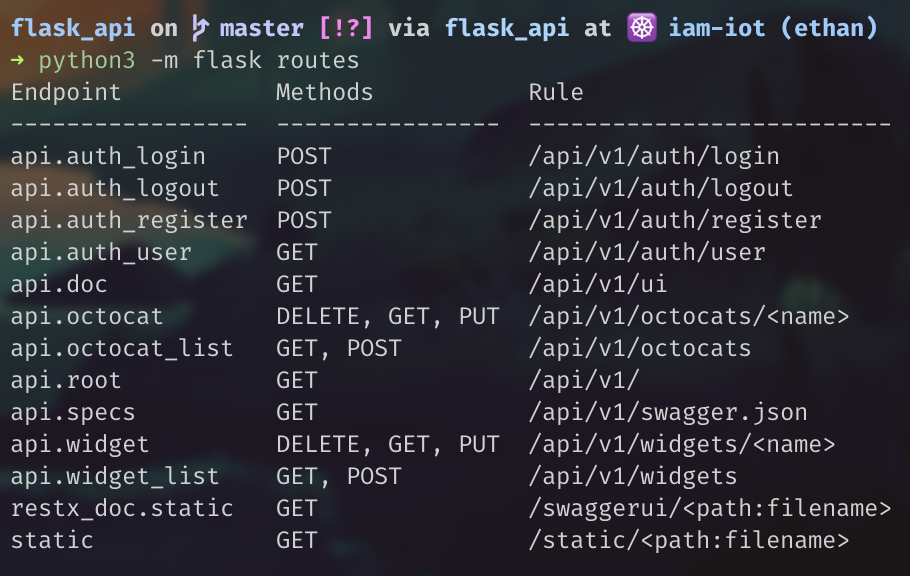

# WorkShop  

Create and manage [OctoCat DB](https://octodex.github.com).  

---

## Start: Prez  

- Tools
    - Tox
    - Pytest
        - conftest.py
        - util.py
        - pytest.ini
    - PydotEnv
    - setup.py

- Architecture
    - /
    - /tests
    - /src
        - /
        - /api
        - /models
        - /util

---

## Init:  

- First, we need to init the DB and create tables:  
`➜ python3 -m flask db init`  
`➜ python3 -m flask db migrate`  
`➜ python3 -m flask db upgrade`  

- Now, launch tox from project root folder, to be sure everything is working:  
`➜ tox`  
It'll run every Utests.  
If some black or flake8 test fail, it's not a problem, it's just some linter things.  

---

## Create model/table:  

- Add new DB model: create model file: `src/flask_api/models/octocat.py`  
Put this in:

```python
"""Class definition for Octocat."""
from datetime import timezone

from flask_api import db
from flask_api.util.datetime_util import utc_now


class Octocat(db.Model):
    """OctcCat Model for storing OctoCats."""

    # Table name, if this is not here, it take the class name
    __tablename__ = "octocat"

    # Column with params
    id = db.Column(db.Integer, primary_key=True, autoincrement=True)
    name = db.Column(db.String(255), unique=True, nullable=False)
    url = db.Column(db.String(255), nullable=False)
    age = db.Column(db.Integer, nullable=False)
    registered_on = db.Column(db.DateTime, default=utc_now)

    def __repr__(self):
        return f"<Octocat name={self.name}, url={self.url}>"
```

- In order to make this new db available into [flask shell](https://aaronluna.dev/series/flask-api-tutorial/part-1/#flask-cliapplication-entry-point):  
(In short the flask shell is the same thing as the python shell but with all the things that are in your app already imported.)  
Make this change into run.py

```python
from flask_api.models.user import User
from flask_api.models.widget import Widget
from flask_api.models.octocat import Octocat  # This


app = create_app(os.getenv("FLASK_ENV", "development"))


@app.shell_context_processor
def shell():
    return {
        "db": db,
        "User": User,
        "BlacklistedToken": BlacklistedToken,
        "Widget": Widget,
        "Octocat": Octocat,  # This
    }
```

---

- Now we need to make change into DB and create the new table:

```bash
# First create change files (commit)
IN:
python3 -m flask db migrate --message "add octocat model"

OUT:
INFO  [alembic.runtime.migration] Context impl SQLiteImpl.
INFO  [alembic.runtime.migration] Will assume non-transactional DDL.
INFO  [alembic.autogenerate.compare] Detected added table 'octocat'
  Generating /Users/ethanchamik/Magic/Project/Flask_fast/flask_api/migrations/versions/6271a1609cb0_add_octocat_model.py ...  done

# Apply changes (push)
IN:
python3 -m flask db upgrade

OUT:
INFO  [alembic.runtime.migration] Context impl SQLiteImpl.
INFO  [alembic.runtime.migration] Will assume non-transactional DDL.
INFO  [alembic.runtime.migration] Running upgrade fa5e93dc5a2f -> 6271a1609cb0, add octocat model
```
---

## Create Logic, Data managment, Endpoints:  

- Then, we'll add the new object managment routes: Create some new folder/files:
    - `src/flask_api/api/octocats`
    - `.../octocats/business.py`
    - `.../octocats/dto.py`
    - `.../octocats/endpoints.py`

- Fil dto.py (Data transfer object):

This file contains the parser logic that'll be used by endpoints.  

```python
"""Parsers and serializers for /auth API endpoints."""
import re
from datetime import date, datetime, time, timezone

from flask_restx import Model
from flask_restx.fields import String, Boolean, Integer, DateTime, List, Nested, Url
from flask_restx.inputs import positive, URL
from flask_restx.reqparse import RequestParser


def octocat_name(name):
    """Validation method for a string containing only letters, numbers, '-' and '_'."""
    if not re.compile(r"^[\w-]+$").match(name):
        raise ValueError(
            f"'{name}' contains one or more invalid characters. Widget name must "
            "contain only letters, numbers, hyphen and underscore characters."
        )
    return name


# Create octocat attributs parser, this'll used before anything else
# for each call on create_octocat
create_octocat_reqparser = RequestParser(bundle_errors=True)
create_octocat_reqparser.add_argument(
    "name",
    type=octocat_name,
    location="form",
    required=True,
    nullable=False,
    case_sensitive=True,
)
create_octocat_reqparser.add_argument(
    "url",
    type=URL(schemes=["http", "https"]),
    location="form",
    required=True,
    nullable=False,
)
create_octocat_reqparser.add_argument(
    "age",
    type=positive,
    location="form",
    required=True,
    nullable=False,
)

# Create update parser by copying create parser
# And remove url field
update_octocat_reqparser = create_octocat_reqparser.copy()
update_octocat_reqparser.remove_argument("name")

# Until EOF: # Not covered by workshop
pagination_reqparser = RequestParser(bundle_errors=True)
pagination_reqparser.add_argument("page", type=positive, required=False, default=1)
pagination_reqparser.add_argument(
    "per_page", type=positive, required=False, choices=[5, 10, 25, 50, 100], default=10
)

octocat_model = Model(
    "Octocat",
    {
        "name": String,
        "url": String,
        "age": Integer,
        "alive": Boolean,
        "link": Url("api.octocat"),
    },
)

pagination_links_model = Model(
    "Nav Links",
    {"self": String, "prev": String, "next": String, "first": String, "last": String},
)

pagination_model = Model(
    "Pagination",
    {
        "links": Nested(pagination_links_model, skip_none=True),
        "has_prev": Boolean,
        "has_next": Boolean,
        "page": Integer,
        "total_pages": Integer(attribute="pages"),
        "items_per_page": Integer(attribute="per_page"),
        "total_items": Integer(attribute="total"),
        "items": List(Nested(octocat_model)),
    },
)
```

- Fil business.py (Logic of the app):

This file contains the logic that'll be used by endpoints.  

```python
"""Business logic for /octocats API endpoints."""
from http import HTTPStatus

from flask import jsonify, url_for
from flask_restx import abort, marshal

from flask_api import db
from flask_api.api.auth.decorators import token_required, admin_token_required
from flask_api.api.octocats.dto import pagination_model, octocat_name
from flask_api.models.octocat import Octocat


@admin_token_required
def create_octocat(octocat_dict):
    name = octocat_dict["name"]

    # Check if a cat exist with this name
    if Octocat.find_by_name(name):
        error = f"Octocat name: {name} already exists, must be unique."
        abort(HTTPStatus.CONFLICT, error, status="fail")

    # Create the cat
    octocat = Octocat(**octocat_dict)
    db.session.add(octocat)
    db.session.commit()

    # Create response
    response = jsonify(status="success", message=f"New octocat added: {name}.")
    response.status_code = HTTPStatus.CREATED
    response.headers["Location"] = url_for("api.octocat", name=name)

    return response


# Not covered by workshop
@token_required
def retrieve_octocat_list(page, per_page):
    pagination = Octocat.query.paginate(page, per_page, error_out=False)
    response_data = marshal(pagination, pagination_model)
    response_data["links"] = _pagination_nav_links(pagination)
    response = jsonify(response_data)
    response.headers["Link"] = _pagination_nav_header_links(pagination)
    response.headers["Total-Count"] = pagination.total
    return response


@token_required
def retrieve_octocat(name):
    # Return what's asked or raise 404 error
    return Octocat.query.filter_by(name=name.lower()).first_or_404(
        description=f"{name} not found in database."
    )


@admin_token_required
def update_octocat(name, octocat_dict):
    """ Update existing octocat or create new one """
    # If the name provided by the client is found in the database,
    # we save the retrieved octocat instance as octocat.
    octocat = Octocat.find_by_name(name.lower())

    # Next, we iterate over the items in octocat_dict and overwrite
    # the attributes of octocat with the values provided by the client.
    if octocat:
        for k, v in octocat_dict.items():
            # The setattr() function sets the value of the attribute of an object.
            setattr(octocat, k, v)

        # Then, the updated octocat is committed to the database.
        db.session.commit()
        message = f"'{name}' was successfully updated"
        response_dict = dict(status="success", message=message)
        return response_dict, HTTPStatus.OK

    # Else:
    try:
        # Check if the given name is valid
        valid_name = octocat_name(name.lower())

    except ValueError as e:
        abort(HTTPStatus.BAD_REQUEST, str(e), status="fail")

    octocat_dict["name"] = valid_name

    return create_octocat(octocat_dict)


@admin_token_required
def delete_octocat(name):
    octocat = Octocat.query.filter_by(name=name.lower()).first_or_404(
        description=f"{name} not found in database."
    )
    db.session.delete(octocat)
    db.session.commit()
    return "", HTTPStatus.NO_CONTENT


# Not covered by workshop
def _pagination_nav_links(pagination):
    nav_links = {}
    per_page = pagination.per_page
    this_page = pagination.page
    last_page = pagination.pages
    nav_links["self"] = url_for("api.octocat_list", page=this_page, per_page=per_page)
    nav_links["first"] = url_for("api.octocat_list", page=1, per_page=per_page)

    if pagination.has_prev:
        nav_links["prev"] = url_for(
            "api.octocat_list", page=this_page - 1, per_page=per_page
        )

    if pagination.has_next:
        nav_links["next"] = url_for(
            "api.octocat_list", page=this_page + 1, per_page=per_page
        )

    nav_links["last"] = url_for("api.octocat_list", page=last_page, per_page=per_page)
    return nav_links


# Not covered by workshop
def _pagination_nav_header_links(pagination):
    url_dict = _pagination_nav_links(pagination)
    link_header = ""

    for rel, url in url_dict.items():
        link_header += f'<{url}>; rel="{rel}", '

    return link_header.strip().strip(",")
```

If you want info about pagination check [this](https://aaronluna.dev/series/flask-api-tutorial/part-6/#flask-sqlalchemy-paginate-method).  

- Fil endpoints.py:

This file contains all endpoints and SwaggerUI documentation.  

```python
"""API endpoint definitions for /octocats namespace."""
from http import HTTPStatus

from flask_restx import Namespace, Resource

from flask_api.api.octocats.dto import (
    create_octocat_reqparser,
    pagination_reqparser,
    octocat_model,
    pagination_links_model,
    pagination_model,
)
from flask_api.api.octocats.business import (
    create_octocat,
    retrieve_octocat_list,
    retrieve_octocat,
    delete_octocat,
)


# Create octocat namespace 
# This create a sublink .../octocats
# And generate another field in SwaggerUI
octocat_ns = Namespace(name="octocats", validate=True)
octocat_ns.models[octocat_model.name] = octocat_model
octocat_ns.models[pagination_links_model.name] = pagination_links_model
octocat_ns.models[pagination_model.name] = pagination_model


# Create routes for .../api/octocats
@octocat_ns.route("", endpoint="octocat_list")
@octocat_ns.response(int(HTTPStatus.BAD_REQUEST), "Validation error.")
@octocat_ns.response(int(HTTPStatus.UNAUTHORIZED), "Unauthorized.")
@octocat_ns.response(int(HTTPStatus.INTERNAL_SERVER_ERROR), "Internal server error.")
class OctocatList(Resource):
    """Handles HTTP requests to URL: /octocats."""

    # Create get method
    # Only for SwaggerUI, tell that security is used for this routes
    @octocat_ns.doc(security="Bearer")
    # Only for SwaggerUI, add response statut and model
    @octocat_ns.response(HTTPStatus.OK, "Retrieved octocat list.", pagination_model)
    # Tell which parser will be used for this routes
    @octocat_ns.expect(pagination_reqparser)
    def get(self):
        """Retrieve a list of octocats."""
        # Parse inputs with given parser
        request_data = pagination_reqparser.parse_args()
        page = request_data.get("page")
        per_page = request_data.get("per_page")
        return retrieve_octocat_list(page, per_page)

    # Create post method
    @octocat_ns.doc(security="Bearer")
    @octocat_ns.response(int(HTTPStatus.CREATED), "Added new octocat.")
    @octocat_ns.response(int(HTTPStatus.FORBIDDEN), "Administrator token required.")
    @octocat_ns.response(int(HTTPStatus.CONFLICT), "octocat name already exists.")
    @octocat_ns.expect(create_octocat_reqparser)
    def post(self):
        """Create a octocat."""
        octocat_dict = create_octocat_reqparser.parse_args()
        return create_octocat(octocat_dict)


@octocat_ns.route("/<name>", endpoint="octocat")
@octocat_ns.param("name", "Octocat name")
@octocat_ns.response(int(HTTPStatus.BAD_REQUEST), "Validation error.")
@octocat_ns.response(int(HTTPStatus.NOT_FOUND), "Octocat not found.")
@octocat_ns.response(int(HTTPStatus.UNAUTHORIZED), "Unauthorized.")
@octocat_ns.response(int(HTTPStatus.INTERNAL_SERVER_ERROR), "Internal server error.")
class Octocat(Resource):
    """Handles HTTP requests to URL: /octocats/{name}."""

    @octocat_ns.doc(security="Bearer")
    @octocat_ns.response(HTTPStatus.OK, "Retrieved octocat.", octocat_model)
    @octocat_ns.marshal_with(octocat_model)
    def get(self, name):
        """Retrieve a octocat."""
        return retrieve_octocat(name)

    @octocat_ns.doc(security="Bearer")
    @octocat_ns.response(int(HTTPStatus.NO_CONTENT), "Octocat was deleted.")
    @octocat_ns.response(int(HTTPStatus.FORBIDDEN), "Administrator token required.")
    def delete(self, name):
        """Delete a octocat."""
        return delete_octocat(name)
```

---

- Now, we need to apply this new namespace, so make change into `src/flask_api/api/__init__.py`:

```python
"""API blueprint configuration."""
from flask import Blueprint
from flask_restx import Api

from flask_api.api.auth.endpoints import auth_ns
from flask_api.api.widgets.endpoints import widget_ns
from flask_api.api.octocats.endpoints import octocat_ns  # this


# Blueprint: Short: A Blueprint object works similarly to a Flask application object,  
# but it is not actually an application.  
# Rather it is a blueprint of how to construct or extend an application.
# Long: https://flask.palletsprojects.com/en/1.1.x/blueprints/
api_bp = Blueprint("api", __name__, url_prefix="/api/v1")
# Authorization config for SwaggerUI
authorizations = {"Bearer": {"type": "apiKey", "in": "header", "name": "Authorization"}}

# API object creation
api = Api(
    api_bp,
    version="1.0",
    title="Flask API with JWT-Based Authentication",
    description="Welcome to the Swagger UI documentation site!",
    doc="/ui",
    authorizations=authorizations,
)

api.add_namespace(auth_ns, path="/auth")
api.add_namespace(widget_ns, path="/widgets")
api.add_namespace(octocat_ns, path="/octocats")  # this

```

---

## Try all this:  

- Check if the routes that we just added are in flask scope:  

`➜ python3 -m flask routes`

 

Maybe yours is a bit different, but if you see DELETE GET GET POST, it's good =)  

- Remember, you see that in business.py:  

`@admin_token_required`  
This tell to flask "Do not run this function if the user is not an admin."  

So, we need an admin user, to create one, run this command:  
`➜ python3 -m flask add-user admin@admin.fr --admin`  

- In order to be happy, and not re generate the f****** token every second...  

Change the token "time to live" for develop env from 15 to 60 in `srv/flask_api/api/config.py`:  
line 36: `TOKEN_EXPIRE_MINUTES = 15`  

- We have all what we need ? I think so, now run the server:  

`➜ python3 -m flask run`  

Like that, you'r running the develop server. You can leave it running for furter change, it'll automaticaly reload itself after almost any change.  

- Now you can have fun with SwaggerUI:  

`localhost:5000/api/v1/ui`  

---

## Well, sh*t:  

- Maybe you see that somethings does not work =)  

Play the game and, find what it is by youself and fix it =)  
Maybe run `tox`again to get some hint. For other hint, read spoilers :p  
Or just take the solution if you'r too lazy =O SHAME ! =O  

- <details>
    <summary>Hint 0</summary>

    Maybe we forgot something when we first create the Octocat model...

</details>

- <details>
    <summary>Hint 1</summary>

    Check other models ?

</details>

- <details>
    <summary>Solution</summary>

    Add this function into `.../models/octocat.py` in the Octocat class:

    ```python
    @classmethod
    def find_by_name(cls, name):
        return cls.query.filter_by(name=name).first()
    ```
</details>

- It's time to run tox a third time:  

`➜ tox`  

- Nice, now All the things that we have create are working =D Congrats !  
Normaly, here some tests does not pass, because we do not create what they needs.  

You can now play with SwaggerUI a bit if you want =)  

---

## Did we have time ? Yeah always !   

Oh, well, not all tests passed... Update ? Update ?   
Yeah, Create, get(s), get and delete but no update ! What a shame !  

Now i'll let you create the update endpoint.  
If you search well, you'll see that in dto/business you already have all what you need for that.  
You just need to create the endpoint. Go ! =D  
As i'm reading this again, i think that this is a bit too easy... Well, we'll see =)  
Again: Or get the solution in the spoiler... but...  

SHAMMEEEE !!!!!  

SHAAAAAMMEEEE !!!!!  

SHAAAAAAAAMMEEEE !!!!!  

SHAAAAAAAAAAAAAAMMEEEE !!!!!  

SHAAAAAAAAAAAAAAAAAAAAMMEEEE !!!!!  

SHAAAAAAAAAAAAAAAAAAAAAAAAAAMMEEEE !!!!!  

SHAAAAAAAAAAAAAAAAAAAAAAAAAAAAAAAAMMEEEE !!!!!  

SHAAAAAAAAAAAAAAAAAAAAAAAAAAAAAAAAAAAAAAAAAAAAMMEEEE !!!!!  

SHAAAAAAAAAAAAAAAAAAAAAAAAAAAAAAAAAAAAAAAAAAAAAAAAAAAAAAAAMMEEEE !!!!!  

SHAAAAAAAAAAAAAAAAAAAAAAAAAAAAAAAAAAAAAAAAAAAAAAAAAAAAAAAAAAAAAAAAAAAAMMEEEE !!!!!  

- <details>
    <summary>Spoiler</summary>

    Add this function into `.../api/octocats/endpoints.py` under the `Octocat` class:  

    Put this:  

    ```python
    @octocat_ns.doc(security="Bearer")
    @octocat_ns.response(int(HTTPStatus.OK), "Octocat was updated.", octocat_model)
    @octocat_ns.response(int(HTTPStatus.CREATED), "Added new octocat.")
    @octocat_ns.response(int(HTTPStatus.FORBIDDEN), "Administrator token required.")
    @octocat_ns.expect(update_octocat_reqparser)
    def put(self, name):
        """Update a octocat."""
        octocat_dict = update_octocat_reqparser.parse_args()
        return update_octocat(name, octocat_dict)
    ```

    Don't forget the imports. =)  

</details>

Now run tox again (you already know the command), to see if it works.  

End ! =D  

## Bonus

- Want to benchmark you api ? Use [Vegeta](https://github.com/tsenart/vegeta).  
